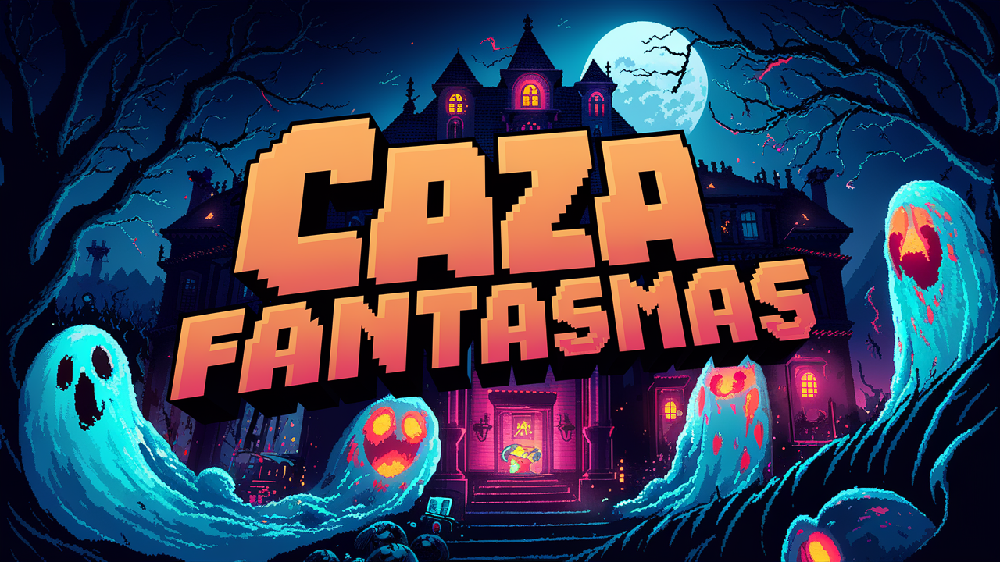

# GhostHunt_Game

# Proyecto Ghostbuster

## Descripción
Ghostbuster es un juego desarrollado en Java con el framework LibGDX. El objetivo del juego es atrapar fantasmas mientras se evitan los fantasmas malos. Utiliza controles simples de izquierda y derecha para mover al atrapador de fantasmas y atrapar la mayor cantidad de fantasmas posible para obtener la puntuación más alta.

## Características
- Controles intuitivos: Utiliza controles simples de izquierda y derecha para mover al atrapador de fantasmas.
- Fantasmas variados: Encuentra una variedad de fantasmas, algunos son buenos y otros malos. ¡Atrapa los buenos y evita los malos!
- Puntuación alta: Desafíate a ti mismo para obtener la puntuación más alta atrapando la mayor cantidad de fantasmas posible.

## Cómo jugar
1. Descarga el archivo ZIP del repositorio o clona el repositorio utilizando Git.
2. Importa el proyecto en tu entorno de desarrollo preferido (Android Studio, Eclipse, IntelliJ, etc.).
3. Ejecuta el proyecto y disfruta del juego.

## Tecnologías utilizadas
- Java
- LibGDX
- Gradle

## Contribuciones
Las contribuciones son bienvenidas. Si quieres mejorar el juego, corrige errores o añade nuevas características, ¡no dudes en enviar un pull request!

## Autores
Este proyecto fue desarrollado por [DARTHGART](https://github.com/darthgart).

## Licencia
Este proyecto está bajo la Licencia MIT. Consulta el archivo `LICENSE` para más detalles.
